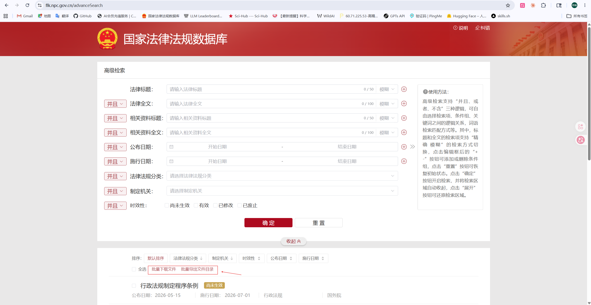

## 前端页面预览


# RAG 法律知识库系统

一个面向中国法律法规的智能检索与分析系统，基于本地向量嵌入 + BM25 混合检索，支持法律咨询问答、法律漂移分析、跨法律多米诺效应检测和反事实立法模拟。

**设计原则**：向量嵌入始终本地计算（fastembed + ONNX），LLM 仅用于生成回答，不调用远程 embedding API。

## 系统功能

| 功能 | 路径 | 说明 |
|------|------|------|
| **法律咨询** | `/ask` | 向量检索 + BM25 混合检索 + DeepSeek 大模型生成带引用的回答 |
| **法律漂移** | `/drift` | 量化分析法律条文在不同版本间的语义漂移（L1 内容漂移 / L2 迁址 / L3 重分配） |
| **多米诺效应** | `/domino` | 跨法律引用网络分析，追踪某条文修订对下游法律的传导影响 |
| **反事实模拟** | `/counterfactual` | 立法仿真：如果某条文向特定方向偏移，会波及哪些下游条文 |

## 架构

```
Backend (FastAPI)          Frontend (Next.js 16)
    |                              |
    |  /ask, /drift_report,        |  /ask, /drift,
    |  /domino_impact,             |  /domino, /counterfactual
    |  /counterfactual             |
    |                              |
    +---- Qdrant (本地向量库)       +---- /api/proxy (代理到后端)
    |
    +---- fastembed (本地 ONNX 嵌入)
    |
    +---- DeepSeek API (仅用于 chat completions)
```

## 前置要求

- Python 3.11+
- Node.js 18+
- DeepSeek API Key（用于 `/ask`、`/counterfactual` 等生成类接口）

## 安装

### 1. 后端依赖

```bash
python -m venv .venv
# Windows:
.venv\Scripts\python.exe -m pip install -r requirements.txt
# macOS/Linux:
.venv/bin/python -m pip install -r requirements.txt
```

### 2. 前端依赖

```bash
cd frontend
npm install
```

### 3. 环境配置

复制 `.env.example` 为 `.env`，按需修改：

```bash
cp .env.example .env
```

关键配置项：

| 变量 | 说明 | 默认值 |
|------|------|--------|
| `DEEPSEEK_API_KEY` | DeepSeek API 密钥 | - |
| `DEEPSEEK_BASE_URL` | DeepSeek API 地址 | `https://api.deepseek.com` |
| `DEEPSEEK_CHAT_MODEL` | 对话模型 | `deepseek-v4-pro` |
| `LOCAL_EMBED_MODEL` | 本地向量模型 | `BAAI/bge-small-zh-v1.5` |

完整配置见 `rag_contract/settings.py`。

## 数据准备

系统需要从 docx 格式的法律文档构建知识库。所有原始数据来自**中国国家法律法规数据库**，请按以下步骤获取：

### 1. 下载法律文档（.docx）

1. 打开 [国家法律法规数据库 — 高级检索](https://flk.npc.gov.cn/advanceSearch)
2. 在检索条件中填写需要下载的法律名称、公布日期等
3. 检索结果页面底部点击 **"批量下载文件"** 按钮
4. 下载的 `.docx` 文件即为法律全文文本

### 2. 下载索引文件（Excel）

在同一检索结果页面，点击 **"批量导出文件目录"** 按钮：
- 该文件包含法律的有效期起止时间、公布日期、施行日期、法律分类等元数据
- 将其保存为 `data/merged.xlsx`



### 3. 整理目录结构

将下载的文件按以下结构放置：

```
law/
└── 法律（全）/
    ├── 《中华人民共和国民法典》.docx
    ├── 《中华人民共和国刑法》.docx
    └── ... （其他法律 docx 文件）

data/
└── merged.xlsx          # 从"批量导出文件目录"下载的 Excel 索引
```

**`merged.xlsx` 格式说明**：
- 第1列：法律标题（应与 docx 文件名对应）
- 第2列：公布日期
- 第3列：施行日期
- 第4列：法律分类（法律/行政法规/司法解释/地方性法规等）

> 注：`data/` 和 `law/` 目录内容不纳入版本控制。首次部署时需自行从上述官网下载原始法律数据。

## 构建知识库

首次运行或更换 embedding 模型时必须全量构建：

```bash
# 全量构建（解析 docx → 分块 → 生成向量 → 写入 Qdrant）
python -m scripts.ingest

# 仅重建向量索引（已有 chunks.jsonl 时）
python -m scripts.build_vector_index
```

**换 embedding 模型前**：删除 `qdrant_data/` 目录，避免向量维度不一致。

### 引用网络（多米诺效应）

```bash
# 从 chunks.jsonl 提取跨法律引用关系
python scripts/extract_citations.py
```

输出 `data/reference_graph.json`，被 `/domino_impact` 接口使用。

## 启动服务

### 后端

```bash
python -m scripts.serve
```

服务启动在 `http://127.0.0.1:8000`，API 文档见 `http://127.0.0.1:8000/docs`。

### 前端

```bash
cd frontend
npm run dev
```

开发服务器启动在 `http://localhost:3000`。

生产构建：

```bash
npm run build
npm run start
```

## API 端点

| 方法 | 路径 | 功能 |
|------|------|------|
| GET | `/health` | 健康检查 |
| POST | `/ask` | 法律咨询问答 |
| POST | `/drift_report` | 指定法律的漂移统计报告 |
| GET | `/drift_report/laws` | 所有法律列表 |
| POST | `/domino_impact` | 跨法律多米诺效应分析 |
| GET | `/domino_impact/stats` | 引用图全局统计 |
| POST | `/counterfactual` | 反事实模拟 |
| GET | `/counterfactual/directions` | 支持的方向列表 |
| GET | `/law_articles/{law_title}` | 某法律的所有条文列表 |

## 测试

```bash
# 环境检查
python scripts/inspect_env.py

# 向量嵌入检查
python scripts/probe_embeddings.py

# API 冒烟测试（需先启动后端）
python scripts/smoke_api.py
```

## 技术栈

- **后端**：FastAPI、Qdrant（本地向量库）、fastembed（ONNX 本地嵌入）、jieba（中文分词）、rank-bm25、OpenAI SDK（兼容 DeepSeek）
- **前端**：Next.js 16、React 19、TypeScript、Tailwind CSS、shadcn/ui、vis-network、echarts/recharts
- **检索**：Hybrid-on-Demand 动态混合检索。主路径为本地向量检索（bge-small-zh-v1.5，余弦相似度）；当 top-1 向量分数 ≥ 0.75 时直接返回，跳过 BM25。若置信度不足，则激活 BM25 重排（jieba 分词），经 min-max 归一化后按向量 0.65 + BM25 0.35 加权融合。权重为经验设定，详见 `experiments/RESULTS.md` 第 6 节。

## 可靠性评估

系统通过五层评估验证核心功能的可靠性：

| 评估层级 | 脚本 | 说明 |
|---------|------|------|
| 回溯验证 | `scripts/backtesting_validation.py` | 用历史真实修订当 GT，验证反事实模拟（专利法 8 组，Recall 11.4% / Precision 30.8%） |
| 批量评估 | `scripts/batch_evaluation.py` | Hard GT（C∩D）下的多法批量测试（刑法 22 条，Mean R_hard 0.952） |
| 消融实验 | `scripts/ablation_factorial.py` | 2×2 因子验证候选集构建（Graph vs Semantic，零重叠证明双源必要） |
| Hard Subset | `scripts/hard_subset_eval.py` | 94K 对检索表征，验证 low-overlap 场景短板（Δ −4.02%） |
| 人工标注 | `scripts/human_eval_4annotator.py` | 4 人标注，旧 200 对（κ=0.782）+ 新 450 对（κ=0.228） |

完整评估结果与实验上下文见 **`experiments/RESULTS.md`**。

## 目录结构

```
app/
  main.py                 # FastAPI 主应用

frontend/
  src/
    app/                  # 页面路由
    components/           # UI 组件 + 可视化组件
    lib/api.ts            # 前端 API 调用
  next.config.ts

rag_contract/             # 核心库
  docx_parse.py           # docx 解析
  chunking.py             # 按"第X条"分块
  lineage.py              # 语义血缘发现
  local_embed.py          # 本地向量生成（ONNX）
  index.py                # Qdrant 操作
  retrieval.py            # 混合检索（向量 + BM25）
  llm_client.py           # DeepSeek API 客户端
  prompting.py            # Prompt 构建
  domino.py               # 跨法律引用网络分析
  counterfactual.py       # 反事实模拟
  settings.py             # 配置管理

scripts/                  # 系统脚本与评估脚本
  # 核心流程
  ingest.py               # 全量构建知识库
  build_vector_index.py   # 仅重建向量索引
  serve.py                # 启动 FastAPI
  extract_citations.py    # 提取跨法律引用

  # 诊断
  probe_embeddings.py     # 检查向量嵌入
  inspect_env.py          # 环境检查
  smoke_api.py            # API 冒烟测试

  # 单元测试
  test_counterfactual.py  # 反事实模拟单元测试
  test_sample_ingest.py   # 血缘样本测试
  test_lineage_one_law.py # 公司法专项血缘测试
  test_keyword_coverage.py# 关键词捕获率测试

  # 可靠性评估（详见 experiments/RESULTS.md）
  backtesting_validation.py   # 回溯验证：反事实 vs 历史修订
  batch_evaluation.py         # 批量评估（刑法/民航法/民法典）
  ablation_factorial.py       # 2×2 消融实验（刑法第234条）
  ablation_civilcode.py       # 民法典消融
  ablation_aviation.py        # 民航法消融
  hard_subset_eval.py         # Hard subset 检索分析
  human_eval_4annotator.py    # 4 标注员一致性分析
  retrieval_comparison.py     # 纯检索对比（Graph/BM25/Vector）
```
